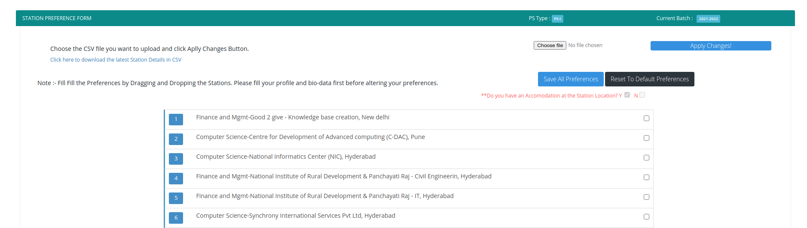
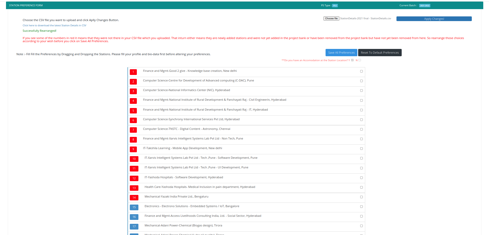
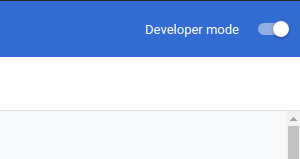
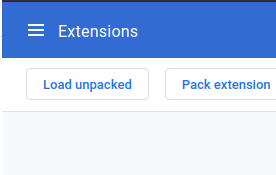

    
      
    <h1><code>PS Companion</code></h1>

<h2>Extension to help in filling preferences for Practice School, BITS-Pilani.</h2>

<!-- 

 -->

<!-- 
 -->

👉 With this extension, you can upload a CSV file with your preferences in order which will update your PSD website preference list.

## 🎓 **How to Use?**

1. Install the extension from [Chrome Webstore](https://chrome.google.com/webstore/detail/ps-companion/jaleeakcpipiimnpmbjlimcgmojdjdad)
2. Download the latest Station Details CSV from the new web app [psitseasy.ml](https://psitseasy.ml/) in the Project Bank Page.
3. Sort the rows of the sheet in the preference order you want. Do not change/delete any columns. Only rearrange with the rows.
4. Now you are ready to upload it in the [Fill station preferences page](http://psd.bits-pilani.ac.in/Student/StudentStationPreference.aspx)
5. Once in the Fill Station Preferences page click on the installed extension and a new section will appear on the top which you can use to upload the CSV file and click on Apply Changes! button.

## :warning: Disclaimer:

-   We arent collecting any information. Your tokens, credentials and CSV file is not taken. The CSV file is processed at frontend.
-   **We have tested the extension a lot, and it works for most/all people. But in anycase please download your pref list form PSMS homepage, and recheck if the order is right. We aren't responisble if anything goes wrong. We are just trying to make your lives easier. So please please please recheck your order from the download button on PSMS homepage under "component status"**
-   In case you face any difficulties please don't hesitate to text any one of us :)

## :camera: Screenshots

## :pushpin: Steps to Install Manually (_Not Recommended_)

-   Click [here](https://github.com/Joe2k/PS-Companion/raw/master/psCompanion.zip) to download the extension ZIP file and Unzip it to a folder.
-   Type chrome://extensions/ in your URL
-   Make sure your developer mode on the right side is checked.
    -   
-   Then Click on "Load unpacked"
    -   
-   Locate the folder you just extracted the zip file into.
-   Visit/Refresh your PSD page and click on the extension icon in your toolbar.
-   You should now see an interface on the top to upload the file with a button.

## Feedback

-   If you find that its not working for you, do ping us on facebook. It'll help us resolve the issue and prevent others from getting stuck at the same thing.
